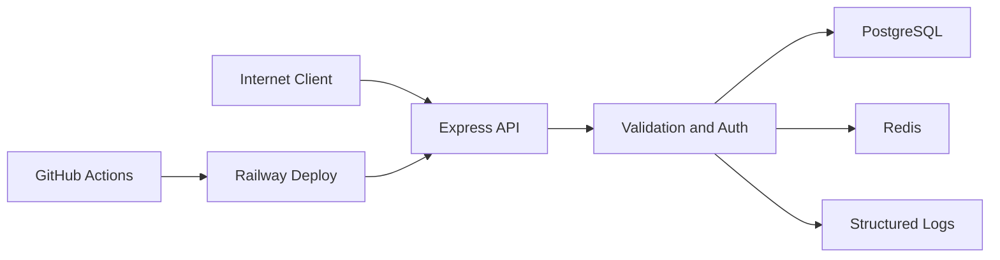

# Auth API Threat Model

## Executive summary

The highest-risk areas in this repository are the public auth mutation flows, the refresh-token rotation boundary, and the integrity of server-side session state. The current design already includes strong controls for token typing, replay detection, validation, and session revocation, but risk remains concentrated around credential abuse, refresh-token theft, rate-limit degradation under infrastructure failure, and operational exposure if production configuration or logging are mishandled.

## Scope and assumptions

In scope:

- `src/`
- `prisma/schema.prisma`
- `.github/workflows/ci.yml`
- `.github/workflows/deploy.yml`
- `railway.json`

Out of scope:

- future identity-platform features not implemented in this repo
- external provider internals for Railway, PostgreSQL, Redis, and GitHub Actions
- local development-only Compose networking beyond its effect on production posture

Assumptions:

- the service is deployed as a public internet-facing API, with the target production flow documented for Railway in `docs/deployment/railway.md`
- this is a single application boundary for one product/team, not a multi-tenant auth SaaS
- sensitive data is limited to credentials, password hashes, JWTs, refresh-token state, session metadata, and audit logs
- there is no privileged admin API beyond the user session management endpoints already exposed in `src/routes/authRoutes.ts`
- user registration is public and self-service

Open questions that would materially change ranking:

- will the production demo stay single-instance or scale horizontally behind Railway
- will production request logs be retained centrally and for how long
- will any PII beyond name and email be added in later iterations

User clarification status:

- no extra service metadata was provided during this documentation pass
- conclusions below therefore use the assumptions above and should be recalibrated if the deployment or data sensitivity changes

## System model

### Primary components

- Express 5 API server with JSON input parsing, request correlation, request logging, route validation, and error handling in `src/app.ts`
- Auth service layer implementing registration, session creation, refresh rotation, and revocation in `src/services/authService.ts`
- JWT issuance and verification layer with separate access and refresh secrets in `src/services/tokenService.ts`
- PostgreSQL persistence through Prisma for users, sessions, and refresh-token state in `prisma/schema.prisma`
- Optional Redis rate-limit backend with in-memory fail-soft fallback in `src/config/redis.ts` and `src/middlewares/rateLimiter.ts`
- GitHub Actions CI and deployment workflows in `.github/workflows/ci.yml` and `.github/workflows/deploy.yml`

### Data flows and trust boundaries

- Internet client -> Express API
  - Data: JSON credentials, refresh tokens, bearer access tokens, headers, correlation IDs
  - Channel: HTTPS in production, HTTP locally
  - Security guarantees: request validation on auth inputs, IP-based rate limiting on mutation routes, bearer parsing, strict JWT verification, request-size limit `1mb`
  - Validation/normalization: route schemas via `validate(...)`, email normalization, correlation ID generation in `src/middlewares/requestId.ts`

- Express API -> PostgreSQL via Prisma
  - Data: user records, password hashes, session state, refresh-token metadata and hashes
  - Channel: database connection string from `DATABASE_URL`
  - Security guarantees: structured ORM access, session-state checks before protected actions
  - Validation/normalization: typed Prisma schema, explicit status transitions in repositories/services

- Express API -> Redis
  - Data: rate-limit counters keyed by bucket and client identity
  - Channel: Redis connection string from `REDIS_URL`
  - Security guarantees: bounded retry behavior, disabled offline queue, fallback on failure
  - Validation/normalization: key names scoped as `rl:<bucket>:<identity>`

- Express API -> log sink
  - Data: correlation IDs, route metadata, auth audit events, fallback warnings
  - Channel: application logs via Pino in `src/logger.ts` and request logger middleware
  - Security guarantees: structured logging and correlation, but no explicit log redaction policy is defined in-repo
  - Validation/normalization: log payloads are constructed from selected fields in middleware/services

- GitHub Actions -> Railway deployment boundary
  - Data: repository contents, Railway token, project/service/environment identifiers, smoke-test URL
  - Channel: GitHub-hosted runners and Railway CLI in `.github/workflows/deploy.yml`
  - Security guarantees: repository secrets, release/manual trigger separation, post-deploy smoke checks
  - Validation/normalization: workflow verifies required secrets before deploy

#### Diagram

## Assets and security objectives

| Asset | Why it matters | Security objective |
| --- | --- | --- |
| Password hashes | Credential compromise leads to account takeover and password cracking risk | C / I |
| Access tokens | Bearer possession enables protected route access until expiry | C / I |
| Refresh tokens and token lineage | Theft or replay can extend attacker access and undermine session integrity | C / I |
| Session state | Revocation and compromise decisions depend on session integrity | I / A |
| User identity records | User names and emails are still personal account data | C / I |
| Rate-limit counters | Abuse resistance depends on correct counting under load or attack | I / A |
| GitHub deployment secrets | Leakage enables unauthorized deploy activity or environment manipulation | C / I |
| Audit and request logs | Needed for detection, incident reconstruction, and operational safety | I / A |

## Attacker model

### Capabilities

- unauthenticated remote attacker can reach public auth endpoints and health/docs endpoints
- attacker can automate high-volume credential attempts or refresh abuse from one or more source IPs
- attacker may steal a bearer token or refresh token from a compromised client/device
- attacker can manipulate request headers and JSON payloads within route schemas
- attacker may observe behavioral differences between valid, invalid, revoked, expired, and reused token paths

### Non-capabilities

- attacker is not assumed to have direct database, Redis, Railway, or GitHub Actions access
- attacker is not assumed to bypass TLS or compromise the Node runtime itself
- attacker is not assumed to control repository code or CI configuration without a separate supply-chain compromise

## Entry points and attack surfaces

| Surface | How reached | Trust boundary | Notes | Evidence (repo path / symbol) |
| --- | --- | --- | --- | --- |
| `POST /v1/auth/register` | public HTTP | Internet -> API | public account creation with password input | `src/routes/authRoutes.ts`, `registerInputSchema` |
| `POST /v1/auth/sessions` | public HTTP | Internet -> API | credential verification and session creation | `src/routes/authRoutes.ts`, `createSession` |
| `POST /v1/auth/tokens/refresh` | public HTTP | Internet -> API | refresh rotation and replay handling | `src/routes/authRoutes.ts`, `refreshSession` |
| `POST /v1/auth/sessions/current/revoke` | public HTTP | Internet -> API | refresh-token-presenting revoke path | `src/routes/authRoutes.ts`, `revokeCurrentSession` |
| `GET /v1/auth/me` and session deletion routes | bearer-protected HTTP | Internet -> API | depends on access token and active server-side session | `src/routes/authRoutes.ts`, `authMiddleware` |
| `GET /docs` and `GET /docs.json` | public HTTP when enabled | Internet -> API | reveals public contract and operational surface area | `src/routes/docsRoutes.ts` |
| `GET /health` and `GET /ready` | public HTTP | Internet -> API | readiness leaks dependency state by design | `src/controllers/healthController.ts` |
| GitHub release/manual deploy | GitHub Actions | CI -> deploy boundary | secrets-backed production deploy path | `.github/workflows/deploy.yml` |

## Top abuse paths

1. Attacker sends repeated login attempts to `POST /v1/auth/sessions`, rotates source IPs, and attempts to brute force credentials until an account is compromised.
2. Attacker steals a refresh token from a client, refreshes before the legitimate client does, and attempts to maintain session access through token rotation.
3. Attacker replays an already-used refresh token to force session compromise and create a denial-of-service condition against the victim account.
4. Attacker steals a still-valid access token and uses it to access protected endpoints until expiry or until the backing session is revoked.
5. Attacker exploits Redis unavailability to push the system onto weaker in-memory rate limiting and increase the effectiveness of distributed auth abuse.
6. Attacker studies `/docs.json`, `/ready`, and auth error behavior to map the service, detect dependency degradation, and optimize credential or replay attacks.
7. Attacker with leaked GitHub repository secrets triggers unauthorized deployments or redirects smoke checks to attacker-controlled infrastructure.

## Threat model table

| Threat ID | Threat source | Prerequisites | Threat action | Impact | Impacted assets | Existing controls (evidence) | Gaps | Recommended mitigations | Detection ideas | Likelihood | Impact severity | Priority |
| --- | --- | --- | --- | --- | --- | --- | --- | --- | --- | --- | --- | --- |
| TM-001 | Remote unauthenticated attacker | Public reachability to auth mutation routes and a target account set | Automate credential stuffing or brute-force login attempts against session creation | Account takeover and auth service pressure | Passwords, user accounts, rate-limit capacity | IP-based auth mutation rate limiter in `src/routes/authRoutes.ts`; Redis-backed counters plus fallback in `src/middlewares/rateLimiter.ts`; invalid credential handling in `src/services/authService.ts` | No account-centric throttling, no lockout/backoff, and fallback is weaker in horizontally scaled deployments | Add account/email-aware throttling, per-route metrics, and alerting on login failure spikes; consider risk-based lockout/backoff for future iterations | Alert on `auth.login.failed` spikes, 429 increases, and Redis fallback warnings | medium | high | high |
| TM-002 | Remote attacker with stolen refresh token | Refresh token theft from a client/device | Use a valid refresh token to mint fresh access tokens before the legitimate client rotates or revokes it | Extended unauthorized session use | Refresh tokens, access tokens, session state | Separate refresh secret and token typing in `src/services/tokenService.ts`; stored hash comparison and server-side lookup in `src/services/authService.ts`; session-state checks in `src/repositories/sessionRepository.ts` | A single stolen active refresh token remains usable until rotated or revoked; no device binding or step-up auth exists | Add operational alerts for refresh anomalies; consider device-binding or stronger re-auth controls in future non-core scope | Track `auth.refresh.succeeded` volume per session and detect unusual IP/user-agent changes | medium | high | high |
| TM-003 | Remote attacker or malicious client with reused refresh token | Possession of a previously used or tampered refresh token | Replay or alter a refresh token to trigger session compromise | Victim session denial of service and incident noise | Session availability, refresh-token chain integrity | Replay detection marks sessions compromised in `src/services/authService.ts`; token status transitions in `src/repositories/refreshTokenRepository.ts`; active-session enforcement in `src/middlewares/authMiddleware.ts` | Intentional replay can still force a valid user session into `COMPROMISED`; no user-facing recovery flow exists in this repo | Add user-visible incident messaging in future product scope; add replay metrics/alerts; document operator recovery steps in runbooks | Alert on `auth.refresh.reuse_detected` and session compromise counts | medium | medium | medium |
| TM-004 | Remote attacker with stolen access token | Access token theft before expiry | Call protected endpoints while the token is still valid | Temporary unauthorized read or session-management actions | Access tokens, session data | Access tokens have short TTL, separate secret, explicit `typ`, `iss`, and `aud` checks in `src/services/tokenService.ts`; active-session check in `src/middlewares/authMiddleware.ts` | Access tokens remain bearer tokens without sender-constraining; exposure window lasts until expiry or session revocation | Keep access token TTL short; add metrics for protected-route 401/200 ratios; consider proof-of-possession only if the product scope expands significantly | Monitor session revocations followed by protected route attempts; track unusual request patterns by session ID | medium | medium | medium |
| TM-005 | Remote attacker exploiting degraded infrastructure | Redis unavailable or unstable during an attack wave | Force the service onto in-memory fallback and distribute attempts across instances or restarts | Reduced abuse resistance and degraded availability posture | Rate-limit controls, auth endpoint availability | Redis fallback warning path in `src/middlewares/rateLimiter.ts`; bounded Redis retry behavior in `src/config/redis.ts`; readiness exposes dependency state in `src/controllers/healthController.ts` | In-memory fallback is not globally coordinated and may be much weaker under horizontal scale | Add observability for fallback frequency; prefer alerts when Redis is down; document scale-related residual risk explicitly | Alert on `rate_limiter_fallback`, Redis readiness failures, and auth traffic spikes | medium | medium | medium |
| TM-006 | Attacker with leaked CI/deploy secret | Compromise of GitHub repository secrets or maintainer environment | Trigger unauthorized deployments or point smoke validation at attacker-chosen targets | Production integrity compromise | Deployment pipeline, production environment, public trust | Deploy workflow validates required secrets and uses GitHub Actions environments in `.github/workflows/deploy.yml`; branch protection requires `quality` and `integration` checks | No in-repo evidence of OIDC-based deploy auth, environment approval rules, or secret rotation policy | Use least-privilege Railway tokens, enable environment protection rules, rotate secrets regularly, and log deployment initiators | Alert on unexpected release/manual deploy events and review deployment history regularly | low | high | medium |

## Criticality calibration

For this repository and its current portfolio/demo context:

- **Critical** means unauthenticated remote compromise of arbitrary accounts or infrastructure without meaningful barriers.
  - Example: auth bypass across all protected endpoints
  - Example: production deploy takeover through weak secret handling with broad blast radius
- **High** means realistic compromise of user accounts or durable integrity loss in the auth lifecycle.
  - Example: effective credential stuffing because rate controls are bypassed
  - Example: active refresh-token theft leading to sustained unauthorized session use
- **Medium** means meaningful security or availability degradation with constrained scope or partial controls already in place.
  - Example: replay forcing targeted session compromise
  - Example: Redis failure weakening coordinated rate limiting
  - Example: short-lived access token theft with server-side session revocation still available
- **Low** means limited information exposure or hard-to-exploit issues with low user harm in the current design.
  - Example: public OpenAPI discovery of already-documented routes
  - Example: noisy health/readiness enumeration without further compromise path

## Focus paths for security review

| Path | Why it matters | Related Threat IDs |
| --- | --- | --- |
| `src/services/authService.ts` | Core logic for login, refresh rotation, replay handling, and session revocation | TM-001, TM-002, TM-003 |
| `src/services/tokenService.ts` | JWT claim issuance and verification, token hashing, and identity extraction | TM-002, TM-004 |
| `src/middlewares/authMiddleware.ts` | Protected-route enforcement of active session state | TM-004 |
| `src/middlewares/rateLimiter.ts` | Main abuse-control boundary and Redis fail-soft behavior | TM-001, TM-005 |
| `src/config/redis.ts` | Redis reliability posture and fallback trigger conditions | TM-005 |
| `src/routes/authRoutes.ts` | Public attack surface for auth mutation and protected session routes | TM-001, TM-002, TM-003, TM-004 |
| `prisma/schema.prisma` | Integrity-critical persistence model for sessions and refresh-token lineage | TM-002, TM-003 |
| `.github/workflows/deploy.yml` | Production deploy path and repository-secret usage | TM-006 |
| `railway.json` | Versioned deploy behavior, healthcheck, and migration execution | TM-006 |

## Quality check

- All discovered runtime entry points are represented in the entry-point table.
- Each main trust boundary appears in either the abuse paths or the threat table.
- Runtime behavior is separated from CI/deploy concerns.
- No additional user clarification was available, so assumptions are explicit.
- Open questions that change priority are listed in scope and assumptions.
